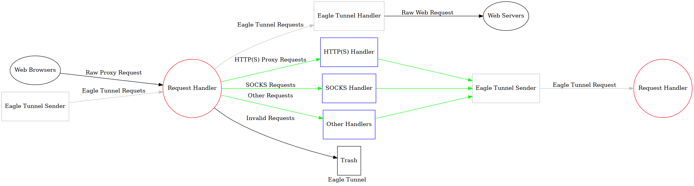

# eagle.tunnel.dotnet.core

代理工具，SSR的替代品

## 基本原理



## 使用方法

### 环境准备

需要安装[.NET Core](https://www.microsoft.com/net/learn/get-started)

### 使用

远端服务

```shell
git clone -b bin https://github.com/eaglexiang/eagle.tunnel.dotnet.core.git
cd ./eagle.tunnel.dotnet.core/eagle.tunnel
dotnet eagle.tunnel.dotnet.core.dll [IP] [Port]
# 例如 dotnet eagle.tunnel.dotnet.core.dll 127.0.0.1 8080
```

本地服务

```shell
git clone -b bin https://github.com/eaglexiang/eagle.tunnel.dotnet.core.git
cd ./eagle.tunnel.dotnet.core/eagle.tunnel
dotnet eagle.tunnel.dotnet.core.dll
# 进入菜单，选择 2.Client
# 填入上文远端服务的IP和Port（例如127.0.0.1 8080）
# 填入你喜欢的本地服务IP和Port（例如127.0.0.1 10000）
```

将手机或电脑的代理地址设置为本地服务的IP和Port